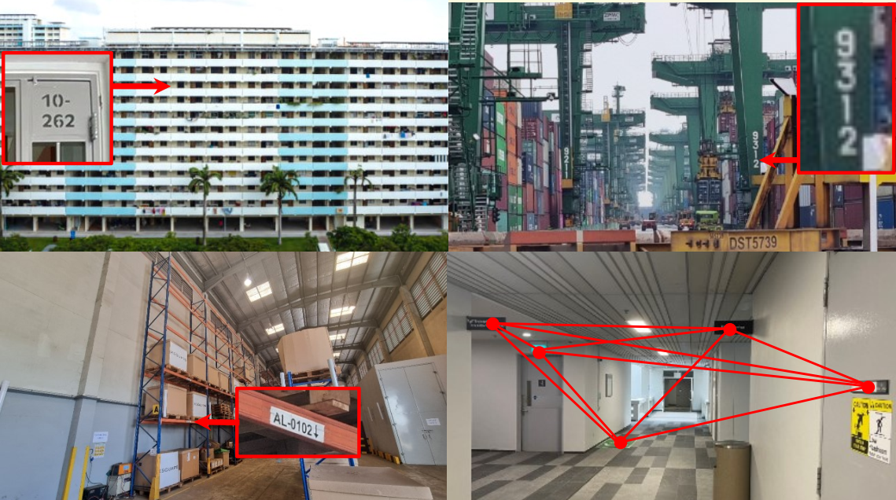

# Robust Loop Closure by Textual Cues in Challenging Environments
This repository is for "Robust Loop Closure by Textual Cues in Challenging Environments".

   
   
  <em>Figure 1: Examples of common FDR scenes, where humans naturally navigate using readable textual signs and their spatial arrangements.</em>

Loop closure is an important task in robot navigation. However, existing methods mostly rely on some implicit or heuristic features of the environment, which can still fail to work in common environments such as corridors, tunnels, and warehouses. Indeed, navigating in such featureless, degenerative, and repetitive (FDR) environments would also pose a significant challenge even for humans, but explicit text cues in the surroundings often provide the best assistance.
This inspires us to propose a multi-modal loop closure method based on explicit human-readable textual cues in FDR environments. Specifically, our approach first extracts scene text entities based on Optical Character Recognition (OCR), then creates a local map of text cues based on accurate LiDAR odometry, and finally identifies loop closure events by a graph-theoretic scheme.
Experiment results demonstrate that this approach has superior performance over existing methods that rely solely on visual and LiDAR sensors.

To benefit the community, we will release the source code and datasets here after its acceptance.
