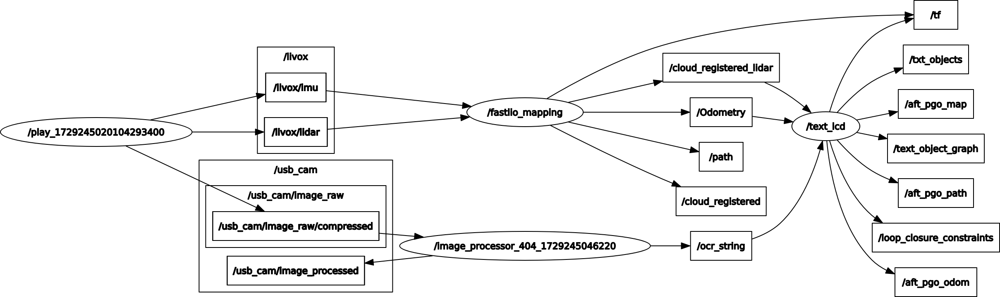

# TEXT_LCD

## News

- ``Dec 5, 2024``: :tada: Our paper has been accepted by RA-L. Please get early access by clicking the button below.

-  ``Oct 22, 2024``: Add arXiv link. If you have any questions, feel free to open an issue.

-  ``Oct 19, 2024``: Initial commit for public release.
<!-- 📄 [Paper](https://arxiv.org/abs/2410.15869) &emsp;
| &emsp;
⬇️ [Dataset](https://entuedu-my.sharepoint.com/:f:/g/personal/tongxing_jin_staff_main_ntu_edu_sg/Evw69kock4JBqy7G6DA_kDcBBKH-2je-iEY4tBfLOIYezw?e=rsFbPK) &emsp;
|&emsp;
🎥 [Demo](https://youtu.be/a4xjhLMNme8) -->

<a href="https://ieeexplore.ieee.org/document/10777294"></a>&emsp;
<a href="https://arxiv.org/abs/2410.15869"></a>&emsp;
<a href="https://entuedu-my.sharepoint.com/:f:/g/personal/tongxing_jin_staff_main_ntu_edu_sg/Evw69kock4JBqy7G6DA_kDcBBKH-2je-iEY4tBfLOIYezw?e=rsFbPK"></a>&emsp;
<a href="https://youtu.be/a4xjhLMNme8"></a>


## Publication

Please cite our paper if you find it useful:

```
@ARTICLE{10777294,
  author={Jin, Tongxing and Nguyen, Thien-Minh and Xu, Xinhang and Yang, Yizhuo and Yuan, Shenghai and Li, Jianping and Xie, Lihua},
  journal={IEEE Robotics and Automation Letters}, 
  title={Robust Loop Closure by Textual Cues in Challenging Environments}, 
  year={2024},
  volume={},
  number={},
  pages={1-8},
  keywords={Laser radar;Cameras;Visualization;Liquid crystal displays;Odometry;Optical character recognition;Simultaneous localization and mapping;Location awareness;Accuracy;Robustness;Loop Closure;LiDAR SLAM;Localization},
  doi={10.1109/LRA.2024.3511397}}

```

## What is TEXT_LCD?
This repository is the implementation of "**Robust Loop Closure by Textual Cues in Challenging Environments**".


<!--  -->

Loop closure is an important task in robot navigation. However, existing methods mostly rely on some implicit or heuristic features of the environment, which can still fail to work in common environments such as corridors, tunnels, and warehouses. Indeed, navigating in such featureless, degenerative, and repetitive (FDR) environments would also pose a significant challenge even for humans, but explicit text cues in the surroundings often provide the best assistance.
This inspires us to propose a multi-modal loop closure method based on explicit human-readable textual cues in FDR environments. Specifically, our approach first extracts scene text entities based on Optical Character Recognition (OCR), then creates a local map of text cues based on accurate LiDAR odometry and finally identifies loop closure events by a graph-theoretic scheme. Experiment results demonstrate that this approach has superior performance over existing methods that rely solely on visual and LiDAR sensors. 

<!-- [Full paper](https://arxiv.org/abs/2410.15869) is now accessible. -->

For more details, please refer to the full paper by clicking the button above.

Introduction video can be found in Youtube by clicking [here](https://youtu.be/a4xjhLMNme8).

## Pipeline
This implementation has integrated our proposed loop closure detection method with front-end module fast-lio2 and OCR module AttentionOCR into a feature-complete and ready-to-use system.  

The communication topology and message flow between multiple nodes are show below:




- The LiDAR and imu data are prosseesed by FAST-LIO2 to provide odometry poses and distorted point cloud;
- Image topic is subscribed by an OCR module deployed in docker, and the recognition results are published in topic /ocr_string.
  
## Dataset & Docker Download

[Dataset & Docker Download Link](https://entuedu-my.sharepoint.com/:f:/g/personal/tongxing_jin_staff_main_ntu_edu_sg/Evw69kock4JBqy7G6DA_kDcBBKH-2je-iEY4tBfLOIYezw?e=rsFbPK)

- Dataset

The ground truth poses files are in the format:
```
timestamp R11 R12 R13 tx R21 R22 R23 ty R31 R32 R33 tz
``` 

- OCR Docker
 
This docker is based on [AttentionOCR](https://github.com/zhang0jhon/AttentionOCR.git). We have installed a ROS in the docker, nodes in host PC and docker communicate by ROS master-slave scheme, you may have to configure the `/etc/hosts` and `.bashrc` file in docker according to your PC.

Optional:
If you have AttentionOCR deployed in your host PC, you can just copy `./TextLCD/backup/test_multi.py` into the main directory of AttentionOCR and make sure ROS communication works well.

## How to use?
- Compile
  ```
  mkdir -p ~/txtlcd_ws/src
  cd ~/txtlcd/src
  git clone https://github.com/TongxingJin/TXTLCD.git
  cd ..
  catkin_make
  rospack find fast_lio
  ```
- Run
```
    # terminal 1: run FAST-LIO2
    cd ~/txtlcd_ws
    source devel/setup.bash
    roslaunch fast_lio mapping_mid360.launch

    # terminal 2: run TextLCD & Pose Graph Optimization
    cd ~/txtlcd_ws
    source devel/setup.bash
    roslaunch text_lcd txtlcd.launch 

    # terminal 3: launch AttentionOCR server in docker
    python3 test_multi.python

    # terminal 4: play rosbag
    rosbag play ***.bag
```

## Acknowledgements 
- This implementation is primarily based on [FAST_LIO_SLAM](https://github.com/gisbi-kim/FAST_LIO_SLAM.git) and [FAST-LIO2](https://github.com/hku-mars/FAST_LIO.git), thanks for the authors.
- Thanks for [AttentionOCR](https://github.com/zhang0jhon/AttentionOCR.git) and [clipper](https://github.com/mit-acl/clipper.git)


## Save map service
```
rosservice call /save_map "destination: ''
optimized: 1"
```

## Stars Stat.

<!-- [](https://github.com/TongxingJin/TXTLCD/stargazers/)

[](https://GitHub.com/TongxingJin/TXTLCD/stargazers/) -->

[](https://GitHub.com/TongxingJin/TXTLCD)